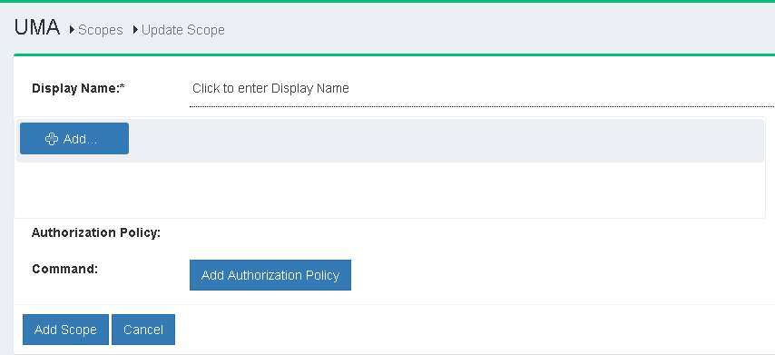
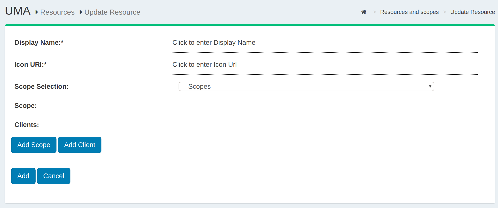
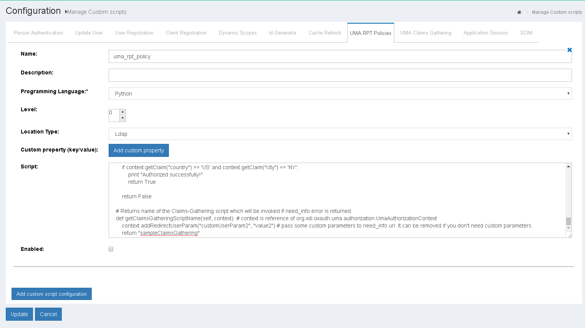
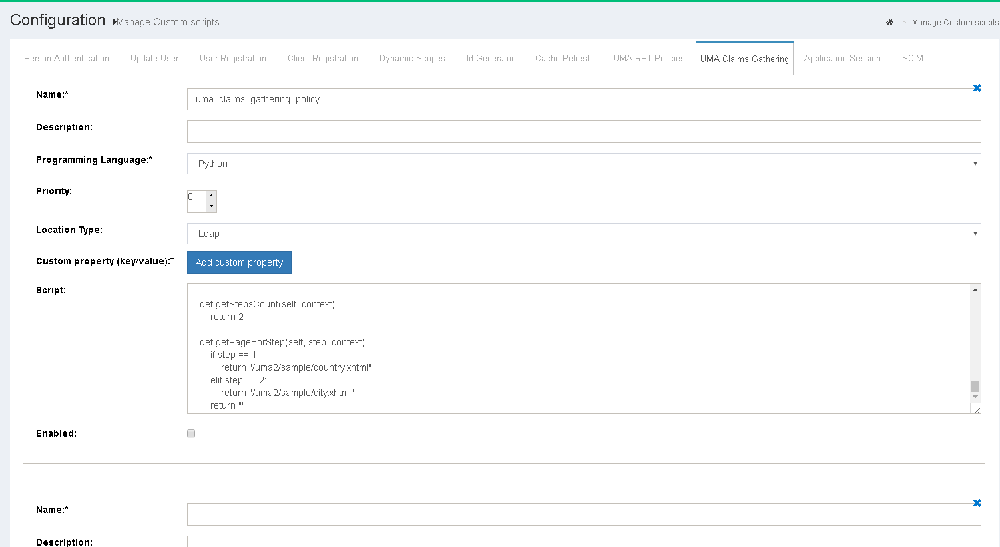
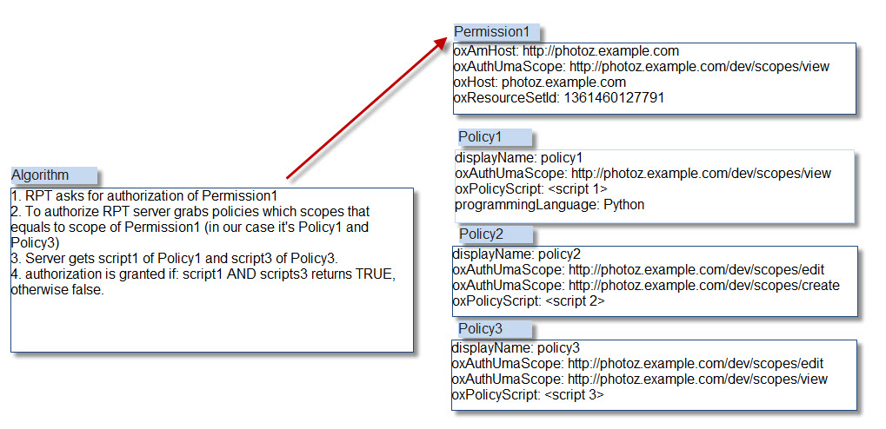

# User Managed Access 2.0 ("UMA 2") Authorization Server (AS)

## Overview

As a profile of OAuth 2.0 that is complementary to OpenID Connect, UMA 2 defines RESTful, 
JSON-based, standardized flows and constructs for coordinating the protection of APIs and 
web resources.

UMA 2 defines interfaces between authorization servers (AS), like Gluu, and resource servers (RS) that enable centralized policy decision-making for improved service delivery, auditing, policy administration, and accountability, even in a very loosely coupled "public API" environment. 

UMA 2 does not standardize a policy expression language, enabling flexibility in 
policy expression and evaluation through XACML, other declarative policy languages, 
or procedural code as warranted by conditions. 

UMA 2 inherits authentication agnosticism from OAuth. It concentrates on authorization, not authentication. 
It has been profiled to work with OpenID Connect to gather identity claims from whoever is attempting access, 
and enables attribute-based ("claims" in OAuth2) authorization (with group-based or role-based policies a natural subset).
 
## Terminology

UMA 2 introduces new terms and enhancements of OAuth term definitions. A few important terms include:

Resource Owner (RO): An entity capable of granting access to a protected resource--the "user" in User-Managed Access. This is typically an end-user, but it can also be non-human entity that is treated as a person for limited legal purposes, such as a corporation.

Resource Server (RS): A server that hosts resources on a resource owner's behalf, registers resources for protection at an authorization server, and is capable of accepting and responding to requests for protected resources.

Authorization Server (AS)_*_: A server that protects, on a resource owner's behalf, resources managed at a resource server.

_*_ _Gluu acts as an UMA AS_.

Learn more in the UMA 2 [Core](https://docs.kantarainitiative.org/uma/wg/uma-core-2.0-20.html), [Federated Authorization](https://docs.kantarainitiative.org/uma/ed/oauth-uma-federated-authz-2.0-07.html) and [Grant](https://docs.kantarainitiative.org/uma/ed/oauth-uma-grant-2.0-06.html) specifications.

## Scopes

UMA 2 scopes are used to grant a client permission to do an action on a protected resource. Different scopes can grant access to the same action. For example, a "read" action can be allowed with scope "read" or "all". 

For some actions the Resource Server (RS) may want multiple scopes at the same time. For instance, a "read" action should only be allowed if the authorization request includes the "read" **and** "all" scopes. UMA 2 scopes are bound to resources and are used to fetch policies that check whether the specified user or client should have access to the resource. 

The scopes are described in JSON and have the following properties:

- name
- icon\_uri

An example of the scope JSON is given below:

```
{
  "name": "Add photo",
  "icon_uri": "https://<hostname>/icons/add_photo_scope.png"
}
```

!!! Note
    The scope JSON may contain custom properties.

The following is an example what an UMA 2 Scope URL may look like:

```
https://<hostname>/uma/scopes/view
```

!!! Note
    The scope endpoint has to be present in UMA configuration to make it discoverable.

The `ldif` for both an internal and external scope is given below:

**Sample ldif**
```
dn: inum=@!1111!8990!BF80,ou=scopes,ou=uma,o=@!1111,o=gluu
displayName: View
inum: @!1111!8990!BF80
objectClass: oxAuthUmaScopeDescription
objectClass: top
oxId: View
oxIconUrl: http://<hostname>/uma/icons/view_scope.png
```

### Add Scopes
This section describes the process of adding UMA scopes in the Gluu Server GUI. Scopes are accessed by navigating to the `UMA` > `Scopes` in the right hand menu.


The search bar can be used to find existing available scopes. New scopes can be added by clicking on the `Add Scope` button which will bring up the interface shown below:



Additionally there is an option to add authorization policy with the new scope.


## Resource Registration
Resources protected by UMA 2 must be registered in oxTrust by navigating to `UMA` > `Resources` or via [UMA-API](../api-guide/uma-api.md). . 


The search bar can be used to find existing available resources. New resources can be added by clicking on the `Add Resource Set` button, which will bring up the interface shown below:



Resource access can be restricted by associated client with `umaRestrictResourceToAssociatedClient` oxauth configuration property. Associated client is array that is automatically populated with `clientDn` that creates it.  

## UMA RPT Authorization Policies
UMA RPT Authorization policy's are associated with UMA scopes. An authorization request has a resource_id and scope(s). Each scope can point to one or more policies. If all policies associated with all scopes return `true`, then access is granted. 

For example, let's say we have the following resource, `GET /photo`. In order to access it the Resource Server (RS) requires the `read` scope to be present. If we have a policy that always return `true`, then any authorization request to `/photo` that includes the `read` scope will result in access granted. 

If we wish to have more sophisticated logic, for example to grant access only to a specific client, then we can add something like `client_id = "@1111"` to the policy. This means that an authorization request to `/photo` will only be granted if the scope includes `read` and is coming from `client_id = "@1111"`.

There are three (3) main properties of a policy:

1. scopes: policy protects resources by scopes; 
2. authorization script: script that is evaluated in order to grant/deny access; 
3. name: a human readable name to the UMA policy.

The following section outlines how to define UMA RPT Authorization policies from the Custom Script menu. The Custom Script page is accessed by navigating to `Configuration` > `Custom Scripts` > `UMA RPT Policies`.



Sample script
```
# Call sequence
# 1. First is call constructor of the Script __init__
# 2. Next init() method
# 3. Next getRequiredClaims() - method returns required claims, so UMA engine checks whether
#    in request RP provided all claims that are required. Pay attention that there can be
#    multiple scripts bound to the scopes, means that UMA engine will build set of required claims
#    from all scripts. If not all claims are provided need_info error is sent to RP.
#    During need_info construction getClaimsGatheringScriptName() method is called
# 4. authorize() method is called if all required claims are provided.
# 5. destroy()

from org.xdi.model.custom.script.type.uma import UmaRptPolicyType
from org.xdi.model.uma import ClaimDefinitionBuilder
from java.lang import String

class UmaRptPolicy(UmaRptPolicyType):
    def __init__(self, currentTimeMillis):
        self.currentTimeMillis = currentTimeMillis

    def init(self, configurationAttributes):
        print "RPT Policy. Initializing ..."
        print "RPT Policy. Initialized successfully"

        return True

    def destroy(self, configurationAttributes):
        print "RPT Policy. Destroying ..."
        print "RPT Policy. Destroyed successfully"
        return True

    def getApiVersion(self):
        return 1

    # Returns required claims definitions.
    # This method must provide definition of all claims that is used in 'authorize' method.
    # Return empty array `[]` if no claims should be gathered.
    # Note : name in both places must match.
    # %1$s - placeholder for issuer. It uses standard Java Formatter, docs : https://docs.oracle.com/javase/7/docs/api/java/util/Formatter.html
    def getRequiredClaims(self, context): # context is reference of org.xdi.oxauth.uma.authorization.UmaAuthorizationContext
        json = """[
        {
            "issuer" : [ "%1$s" ],
            "name" : "country",
            "claim_token_format" : [ "http://openid.net/specs/openid-connect-core-1_0.html#IDToken" ],
            "claim_type" : "string",
            "friendly_name" : "country"
        },
        {
            "issuer" : [ "%1$s" ],
            "name" : "city",
            "claim_token_format" : [ "http://openid.net/specs/openid-connect-core-1_0.html#IDToken" ],
            "claim_type" : "string",
            "friendly_name" : "city"
        }
        ]"""
        context.addRedirectUserParam("customUserParam1", "value1") # pass some custom parameters to need_info uri. It can be removed if you don't need custom parameters.
        return ClaimDefinitionBuilder.build(String.format(json, context.getIssuer()))

    # Main authorization method. Must return True or False.
    def authorize(self, context): # context is reference of org.xdi.oxauth.uma.authorization.UmaAuthorizationContext
        print "RPT Policy. Authorizing ..."

        if context.getClaim("country") == 'US' and context.getClaim("city") == 'NY':
            print "Authorized successfully!"
            return True

        return False

    # Returns name of the Claims-Gathering script which will be invoked if need_info error is returned. Return blank/empty string if claims gathering flow is not involved.
    def getClaimsGatheringScriptName(self, context): # context is reference of org.xdi.oxauth.uma.authorization.UmaAuthorizationContext
        context.addRedirectUserParam("customUserParam2", "value2") # pass some custom parameters to need_info uri. It can be removed if you don't need custom parameters.
        return "sampleClaimsGathering"
```

### UMA 2 Claims-Gathering

Sometimes RPT Authorization Policy may require additional claims that has to be provided by the user. In this case Claims-Gathering Flow can be used to gather such information. The logic is coded as custom script and can be added by navigating to `Configuration` > `Custom Scripts` > `UMA Claims-Gathering`.



Sample script
```
from org.xdi.model.custom.script.type.uma import UmaClaimsGatheringType

class UmaClaimsGathering(UmaClaimsGatheringType):

    def __init__(self, currentTimeMillis):
        self.currentTimeMillis = currentTimeMillis

    def init(self, configurationAttributes):
        print "Claims-Gathering. Initializing ..."
        print "Claims-Gathering. Initialized successfully"

        return True

    def destroy(self, configurationAttributes):
        print "Claims-Gathering. Destroying ..."
        print "Claims-Gathering. Destroyed successfully"
        return True

    def getApiVersion(self):
        return 1


    # Main gather method. Must return True (if gathering performed successfully) or False (if fail).
    # Method must set claim into context (via context.putClaim('name', value)) in order to persist it (otherwise it will be lost).
    # All user entered values can be access via Map<String, String> context.getPageClaims()
    def gather(self, step, context): # context is reference of org.xdi.oxauth.uma.authorization.UmaGatherContext
        print "Claims-Gathering. Gathering ..."

        if step == 1:
            if (context.getPageClaims().containsKey("country")):
                country = context.getPageClaims().get("country")
                print "Country: " + country

                context.putClaim("country", country)
                return True

            print "Claims-Gathering. 'country' is not provided on step 1."
            return False

        elif step == 2:
            if (context.getPageClaims().containsKey("city")):
                city = context.getPageClaims().get("city")
                print "City: " + city

                context.putClaim("city", city)
                print "Claims-Gathering. 'city' is not provided on step 2."
                return True

        return False

    def getNextStep(self, step, context):
        return -1

    def prepareForStep(self, step, context):
        if step == 10 and not context.isAuthenticated():
            # user is not authenticated, so we are redirecting user to authorization endpoint
            # client_id is specified via configuration attribute.
            # Make sure that given client has redirect_uri to Claims-Gathering Endpoint with parameter authentication=true
            # Sample https://sample.com/restv1/uma/gather_claims?authentication=true
            # If redirect to external url is performated, make sure that viewAction has onPostback="true" (otherwise redirect will not work)
            # After user is authenticated then within the script it's possible to get user attributes as
            # context.getUser("uid", "sn")
            # If user is authenticated to current AS (to the same server, not external one) then it's possible to
            # access Connect session attributes directly (no need to obtain id_token after redirect with 'code').
            # To fetch attributes please use getConnectSessionAttributes() method.

            print "User is not authenticated. Redirect for authentication ..."
            clientId = context.getConfigurationAttributes().get("client_id").getValue2()
            redirectUri = context.getClaimsGatheringEndpoint() + "?authentication=true" # without authentication=true parameter it will not work
            authorizationUrl = context.getAuthorizationEndpoint() + "?client_id=" + clientId + "&redirect_uri=" + redirectUri + "&scope=openid&response_type=code"
            context.redirectToExternalUrl(authorizationUrl) # redirect to external url
            return False
        if step == 10 and context.isAuthenticated(): # example how to get session attribute if user is authenticated to same AS
            arc = context.getConnectSessionAttributes().get("acr")

        return True

    def getStepsCount(self, context):
        return 2

    def getPageForStep(self, step, context):
        if step == 1:
            return "/uma2/sample/country.xhtml"
        elif step == 2:
            return "/uma2/sample/city.xhtml"
        return ""
```

### UMA 2 RPT Authorization Policy Algorithm
The UMA 2 policy algorithm has two rules that must be followed:

1. UMA policies protect resources based on scopes. If a scope is protected by a policy, then the policy script must reutrn `true` in order to authorize access during RPT authorization.

2. Multiple policies can protect a single scope. In such a case, all the policies must retun `true` to authorize access or else access will be denied.

 

### UMA 2 Client Authentication

UMA 2 is regular OAuth 2 Token Endpoint. Therefore it support all client authentications then in regular OAuth2/OpenID Connect.

However there is one special client authentication method which is using `access_token` obtained by user to authenticated the client. Means client that was used during user authentication is used for client authentication. Of course `access_token` must be valid.

Non-normative example

```json
POST /token HTTP/1.1
Host: server.example.com
Content-Type: application/x-www-form-urlencoded
Authorization: AccessToken czZCaGRSa3F0MzpnWDFmQmF0M2JW
...
```


## Scopes Expressions

UMA 2 Scope expressions is Gluu invented extension of UMA 2 which gives flexible way to 
combine scopes and thus propose more robust way to grant access.

### Register resource with scope_expression

RS registers resource 

!!! Note
        new `scope_expression` field, `resource_scopes` is ignored in this case

```json
{  
   "resource_scopes":[],
   "description":"Collection of digital photographs",
   "icon_uri":"http://www.example.com/icons/flower.png",
   "name":"Photo Album",
   "type":"http://www.example.com/rsrcs/photoalbum",
   "scope_expression": {
      "rule": {
         "and": [
            {
               "or": [
                   {"var": 0},
                   {"var": 1}
               ]
            },
            {"var": 2}
         ]
      },
      "data": [
         "http://photoz.example.com/dev/actions/all",
         "http://photoz.example.com/dev/actions/add",
         "http://photoz.example.com/dev/actions/internalClient"
      ]
   }
}

```

### Ticket registration

RS registers tickets with all scopes mentioned in "data" (we need all scopes in order to evaluate expression, all or nothing principle)

```json

{  
   "resource_id":"112210f47de98100",
   "resource_scopes":[  
       "http://photoz.example.com/dev/actions/all",
       "http://photoz.example.com/dev/actions/add",
       "http://photoz.example.com/dev/actions/internalClient"
   ]
}
```

### Evaluation

UMA Engine iterates over each scope and fetch ALL policies for each scope. Evaluates all policies.
a) not enough claims - return need_info error
b) enough claims - evaluate results from ALL policies with "AND" rule for ONE given scope.
   b1) `http://photoz.example.com/dev/actions/all` -  `policyA AND policyB` => false
   b2) `http://photoz.example.com/dev/actions/add` -  `policyA AND policyD` => true
   b3) `http://photoz.example.com/dev/actions/internalClient` - `policyD AND policyE and policyK` => true

Results in expression : `(false OR true) AND true` => `true`

Below is example of including all scopes except `http://photoz.example.com/dev/actions/all` scope (because for this part of expression `false` is returned). 

```json
{  
   "active":true,
   "exp":1256953732,
   "iat":1256912345,
   "permissions":[  
      {  
         "resource_id":"112210f47de98100",
         "resource_scopes":[  
            "http://photoz.example.com/dev/actions/add",
            "http://photoz.example.com/dev/actions/internalClient"
         ],
         "exp":1256953732
      }
   ]
}
```

## RPT as JWT

By default RPT is plain bearer token. It is possible to return RPT as signed JWT. It is configurable via `rpt_as_jwt` boolean client property. Signed RPT JWT contains:

- `pct_claims` - list of PCT claims
- `permissions` - list of permissions for given RPT
- `exp` - expiration date in seconds
- `iat` - creation date in seconds
- `iss` - issuer
- `aud` - audience
- `client_id` - client id

Please note that it is not possible to update existing RPT at Token Endpoint if `rpt_as_jwt=true` for client since JWT has to be re-generated to encode new permissions. Therefore RPT as JWT is generated if existing RPT is not provided (at `rpt` request parameter) during requesting RPT at Token Endpoint. 

RPT as JWT is signed with algorithm set by `access_token_signing_alg` client property or otherwise if it is not set then by `defaultSignatureAlgorithm` oxauth configuration property. 

Example of decoded JWT payload claims:

```json
{
  "iss": "https://myop.gluu.org",
  "aud": "@!DBE5.84F8.631A.9172!0001!CD07.49BE!0008!AB77!1A2B",
  "client_id": "@!DBE5.84F8.631A.9172!0001!CD07.49BE!0008!AB77!1A2B",
  "exp": 1544112457,
  "iat": 1544108857,
  "pct_claims": {
    "country": "US",
    "city": "NY"
  },
  "permissions": [
    {
      "resource_id": "eb2591de-db07-498d-860a-b7c223be302e",
      "resource_scopes": [
        "http://photoz.example.com/dev/scopes/view"
      ],
      "exp": 1544112448,
      "params": null
    }
  ]
}
``` 

## UMA RS Implementation
If you need to secure apps with OpenID Connect RP and UMA 2 RS code, you might want to take a look at our [oxd client software](http://oxd.gluu.org).

## UMA API
Learn more about the Gluu Server's [UMA-API](../api-guide/uma-api.md). 


